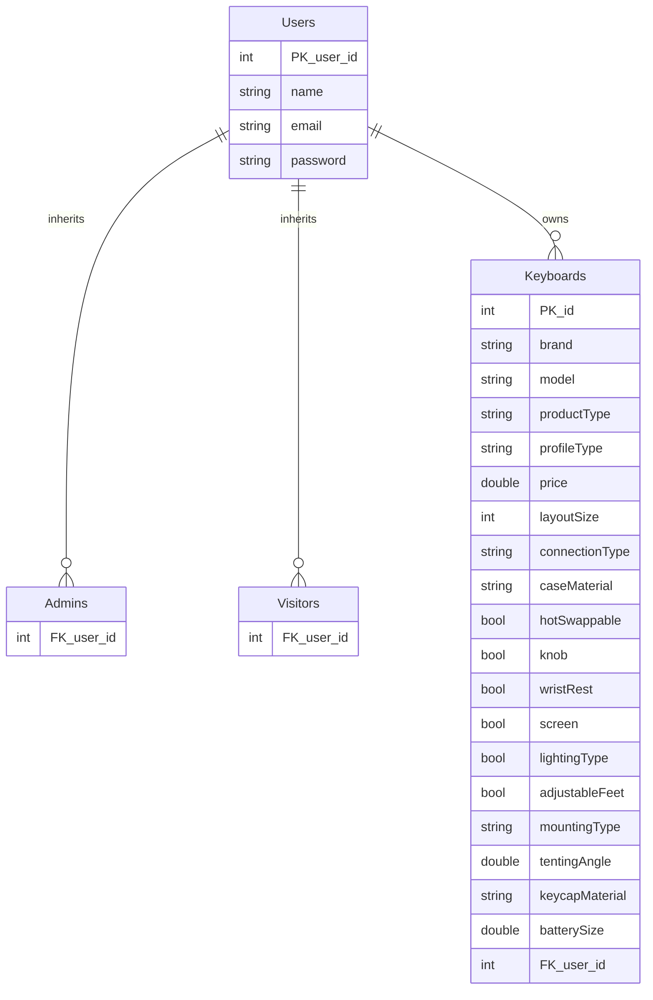

# PC Copilot
Proejct description

## Table of Contents

- [Installation](#features)
- [Project Structure](#project-structure)
## features
## project-structure
### Database design

```mermaid
erDiagram
    Users {
        int PK_user_id
        string name
        string email
        string password
    }
    Admins {
        int FK_user_id
    }
    Visitors {
        int FK_user_id
    }
    Keyboards {
        int PK_id
        string brand
        string model
        string productType
        string profileType
        double price
        int layoutSize
        string connectionType
        string caseMaterial
        bool hotSwappable
        bool knob
        bool wristRest
        bool screen
        bool lightingType
        bool adjustableFeet
        string mountingType
        double tentingAngle
        string keycapMaterial
        double batterySize
        int FK_user_id
    }
    Users ||--o{ Admins : "inherits"
    Users ||--o{ Visitors : "inherits"
    Users ||--o{ Keyboards : "owns"
```
