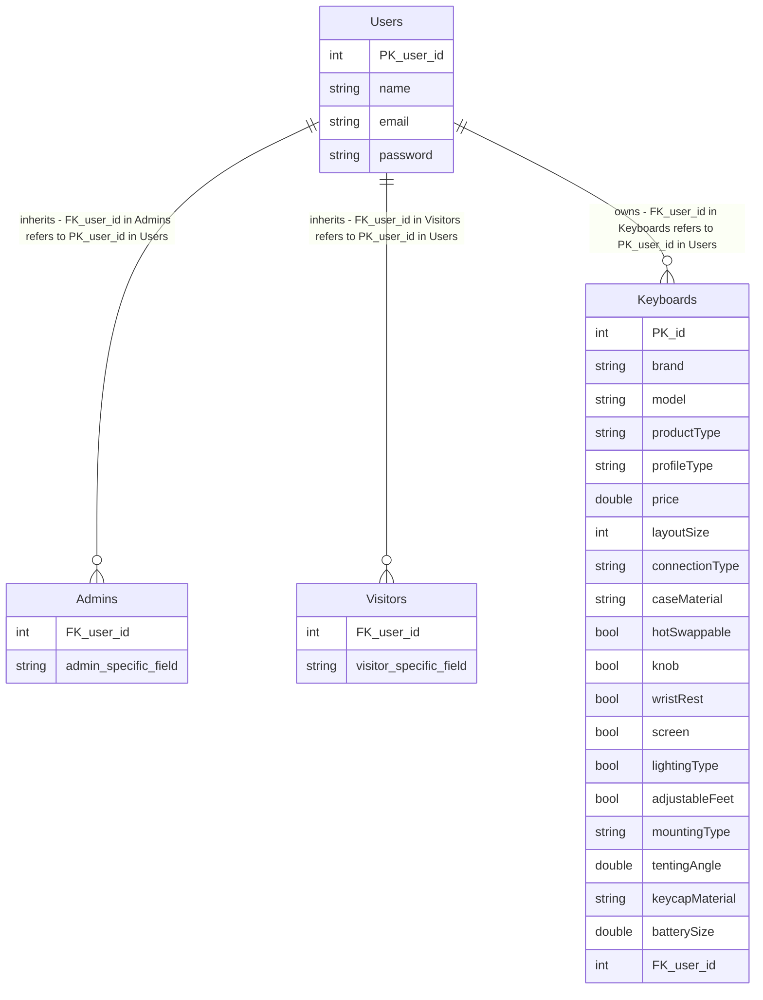

```mermaid
erDiagram
    Users {
        int PK_user_id
        string name
        string email
        string password
    }
    Admins {
        int FK_user_id
        string admin_specific_field
    }
    Visitors {
        int FK_user_id
        string visitor_specific_field
    }
    Keyboards {
        int PK_id
        string brand
        string model
        string productType
        string profileType
        double price
        int layoutSize
        string connectionType
        string caseMaterial
        bool hotSwappable
        bool knob
        bool wristRest
        bool screen
        bool lightingType
        bool adjustableFeet
        string mountingType
        double tentingAngle
        string keycapMaterial
        double batterySize
        int FK_user_id
    }
    Users ||--o{ Admins : "inherits - FK_user_id in Admins refers to PK_user_id in Users"
    Users ||--o{ Visitors : "inherits - FK_user_id in Visitors refers to PK_user_id in Users"
    Users ||--o{ Keyboards : "owns - FK_user_id in Keyboards refers to PK_user_id in Users"
```
